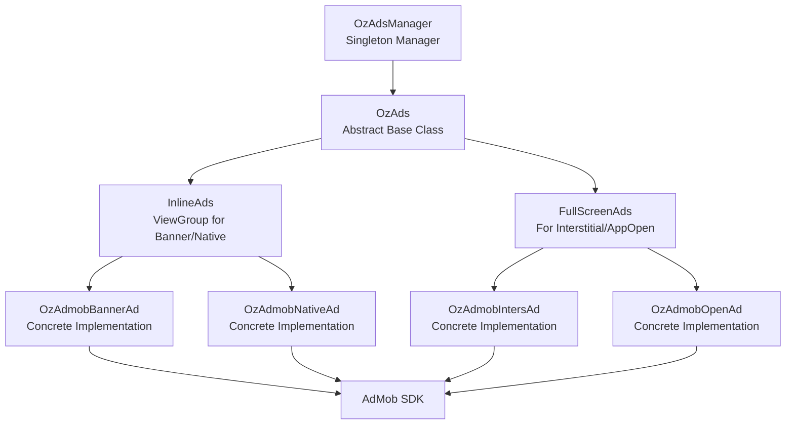

<div align="center">


# OzAds - Android Ad Integration Library

[](https://kotlinlang.org)
[](https://android-arsenal.com/api?level=24)
[](LICENSE.txt)
[](https://developers.google.com/admob/android/quick-start)

**A powerful, easy-to-use wrapper library for integrating AdMob ads into your Android applications**

[Features](#-features) • [Installation](#-installation) • [Quick Start](#-quick-start) • [Documentation](#-documentation) • [Architecture](#-architecture) • [License](#-license)

</div>

---

## 📋 Overview

OzAds is a comprehensive Android library that simplifies ad integration by providing clean, reusable wrappers for AdMob advertisements. Built with Kotlin, it supports both traditional Android View System (XML) and modern Jetpack Compose, making it perfect for any Android project.

### Why OzAds?

- 🎯 **Simple API** - Intuitive methods that reduce boilerplate code
- 🔄 **Auto-Refresh** - Built-in automatic ad refresh with configurable intervals
- 📱 **Lifecycle-Aware** - Automatically handles Android lifecycle events
- 🎨 **Shimmer Loading** - Beautiful loading animations for better UX
- 🔧 **Flexible** - Works with both XML layouts and Jetpack Compose
- 📐 **Dynamic Sizing** - Automatic adaptive banner sizing based on container
- 🎭 **Collapsible Banners** - User-friendly collapsible ad experience
- 🏗️ **Clean Architecture** - Well-structured, maintainable codebase

---

## ✨ Features

### Supported Ad Formats

| Ad Type | Description | Use Case |
|---------|-------------|----------|
| **Banner Ads** | Standard banner advertisements | Persistent bottom/top banners |
| **Native Ads** | Customizable native ad layouts | In-feed content, card layouts |
| **Interstitial Ads** | Full-screen ads | Between content transitions |
| **App Open Ads** | Launch screen advertisements | App start/resume |

### Key Capabilities

- ✅ **Automatic Lifecycle Management** - No manual pause/resume needed
- ✅ **Smart Preloading** - Preload ads for instant display
- ✅ **Error Handling** - Robust error handling with callbacks
- ✅ **Visibility Detection** - Pauses ads when not visible
- ✅ **Memory Efficient** - Proper cleanup and resource management
- ✅ **Customizable Listeners** - Full control over ad events
- ✅ **Cooldown Management** - Built-in cooldown for App Open ads

---

## 📦 Installation

### Step 1: Add Dependencies

Add the library to your module's `build.gradle.kts`:

```kotlin
dependencies {
    // OzAds Library
    implementation("com.oz.android:oz-ads:1.0.0") // Update with actual version
    
    // Required dependencies (if not already included)
    implementation("com.google.android.gms:play-services-ads:24.9.0")
    implementation("androidx.lifecycle:lifecycle-runtime-ktx:2.10.0")
}
```

### Step 2: Configure AndroidManifest.xml

Add your AdMob App ID to your `AndroidManifest.xml`:

```xml
<manifest xmlns:android="http://schemas.android.com/apk/res/android">
    <application>
        <!-- ... other configuration ... -->
        
        <!-- AdMob App ID - REQUIRED -->
        <meta-data
            android:name="com.google.android.gms.ads.APPLICATION_ID"
            android:value="ca-app-pub-XXXXXXXXXXXXXXXX~YYYYYYYYYY"/>
            
    </application>
</manifest>
```

> [!IMPORTANT]
> Replace `ca-app-pub-XXXXXXXXXXXXXXXX~YYYYYYYYYY` with your actual AdMob App ID from the [AdMob Console](https://apps.admob.com/).
> 
> For testing, you can use: `ca-app-pub-3940256099942544~3347511713`

### Step 3: Initialize OzAdsManager

Initialize the library in your `Application` class or main `Activity`:

```kotlin
import com.oz.android.wrapper.OzAdsManager
import androidx.lifecycle.lifecycleScope
import kotlinx.coroutines.launch

class MyApplication : Application() {
    override fun onCreate() {
        super.onCreate()
        
        // Initialize OzAds
        OzAdsManager.getInstance().init(this)
    }
}
```

Or in your `MainActivity`:

```kotlin
class MainActivity : AppCompatActivity() {
    override fun onCreate(savedInstanceState: Bundle?) {
        super.onCreate(savedInstanceState)
        
        lifecycleScope.launch {
            OzAdsManager.getInstance().init(this@MainActivity)
        }
    }
}
```

---

## 🚀 Quick Start

### Banner Ad Example

#### XML Layout
```xml
<com.oz.android.wrapper.OzAdmobBannerAd
    android:id="@+id/banner_ad"
    android:layout_width="match_parent"
    android:layout_height="wrap_content" />
```

#### Kotlin Code
```kotlin
val bannerAd = findViewById<OzAdmobBannerAd>(R.id.banner_ad)

// Configure and load
bannerAd.setAdUnitId("banner_home", "ca-app-pub-3940256099942544/6300978111")
bannerAd.loadThenShow()

// Optional: Enable auto-refresh every 60 seconds
bannerAd.setRefreshTime(60000)

// Optional: Enable collapsible banner
bannerAd.setCollapsibleTop() // or setCollapsibleBottom()
```

#### Jetpack Compose
```kotlin
@Composable
fun BannerAdView() {
    AndroidView(
        factory = { context ->
            OzAdmobBannerAd(context).apply {
                setAdUnitId("banner_compose", "ca-app-pub-3940256099942544/6300978111")
                setCollapsibleTop()
                loadThenShow()
            }
        },
        modifier = Modifier.fillMaxWidth()
    )
}
```

---

## 📖 Documentation

### 1. Banner Ads (`OzAdmobBannerAd`)

Banner ads are rectangular ads that appear at the top or bottom of your app's UI.

#### Features
- ✅ Adaptive sizing based on container width
- ✅ Auto-refresh capability
- ✅ Collapsible banners for better UX
- ✅ Shimmer loading animation

#### Basic Usage

```kotlin
val bannerAd = findViewById<OzAdmobBannerAd>(R.id.banner_ad)

// Set Ad Unit ID with a unique key
bannerAd.setAdUnitId("home_banner", "ca-app-pub-3940256099942544/6300978111")

// Load and show
bannerAd.loadThenShow()
```

#### Advanced Configuration

```kotlin
// Enable auto-refresh every 30 seconds
bannerAd.setRefreshTime(30000)

// Enable collapsible banner (top or bottom)
bannerAd.setCollapsibleTop()     // Collapse button at top
// OR
bannerAd.setCollapsibleBottom()  // Collapse button at bottom

// Disable collapsible feature
bannerAd.disableCollapsible()

// Add custom listener
bannerAd.listener = object : OzAdListener<AdmobBanner>() {
    override fun onAdLoaded(ad: AdmobBanner) {
        Log.d("BannerAd", "Ad loaded successfully")
    }
    
    override fun onAdFailedToLoad(error: LoadAdError) {
        Log.e("BannerAd", "Failed to load: ${error.message}")
    }
}
```

> [!TIP]
> Collapsible banners must be configured **before** calling `loadThenShow()`. Changes after loading require a refresh to take effect.

---

### 2. Native Ads (`OzAdmobNativeAd`)

Native ads match the look and feel of your app's content.

#### Prerequisites
Create a custom native ad layout (e.g., `layout_native_ad.xml`):

```xml
<com.google.android.gms.ads.nativead.NativeAdView
    xmlns:android="http://schemas.android.com/apk/res/android"
    android:layout_width="match_parent"
    android:layout_height="wrap_content">
    
    <LinearLayout
        android:layout_width="match_parent"
        android:layout_height="wrap_content"
        android:orientation="vertical"
        android:padding="16dp">
        
        <TextView
            android:id="@+id/ad_headline"
            android:layout_width="match_parent"
            android:layout_height="wrap_content"
            android:textSize="16sp"
            android:textStyle="bold"/>
        
        <TextView
            android:id="@+id/ad_body"
            android:layout_width="match_parent"
            android:layout_height="wrap_content"
            android:textSize="14sp"/>
        
        <com.google.android.gms.ads.nativead.MediaView
            android:id="@+id/ad_media"
            android:layout_width="match_parent"
            android:layout_height="200dp"/>
        
        <Button
            android:id="@+id/ad_call_to_action"
            android:layout_width="wrap_content"
            android:layout_height="wrap_content"
            android:layout_gravity="end"/>
    </LinearLayout>
</com.google.android.gms.ads.nativead.NativeAdView>
```

#### XML Usage

```xml
<com.oz.android.wrapper.OzAdmobNativeAd
    android:id="@+id/native_ad"
    android:layout_width="match_parent"
    android:layout_height="wrap_content" />
```

```kotlin
val nativeAd = findViewById<OzAdmobNativeAd>(R.id.native_ad)

nativeAd.setAdUnitId("native_home", "ca-app-pub-3940256099942544/2247696110")
nativeAd.setLayoutId(R.layout.layout_native_ad)
nativeAd.loadThenShow()
```

#### Jetpack Compose Usage

```kotlin
@Composable
fun NativeAdView() {
    AndroidView(
        factory = { context ->
            OzAdmobNativeAd(context).apply {
                setAdUnitId("native_compose", "ca-app-pub-3940256099942544/2247696110")
                setLayoutId(R.layout.layout_native_large)
                loadThenShow()
            }
        },
        modifier = Modifier
            .fillMaxWidth()
            .height(300.dp)
    )
}
```

---

### 3. Interstitial Ads (`OzAdmobIntersAd`)

Full-screen ads that cover the interface of your app.

#### Basic Usage

```kotlin
val intersAd = OzAdmobIntersAd(context)
intersAd.setAdUnitId("inter_level_complete", "ca-app-pub-3940256099942544/1033173712")

// Load and show immediately when ready
intersAd.loadThenShow(activity)
```

#### Advanced Usage with Listener

```kotlin
val intersAd = OzAdmobIntersAd(context)
intersAd.setAdUnitId("inter_game_over", "ca-app-pub-3940256099942544/1033173712")

// Add listener for ad events
intersAd.listener = object : OzAdListener<AdmobInterstitial>() {
    override fun onAdLoaded(ad: AdmobInterstitial) {
        Log.d("InterAd", "Interstitial loaded")
    }
    
    override fun onAdShowedFullScreenContent() {
        Log.d("InterAd", "Interstitial shown")
    }
    
    override fun onAdDismissedFullScreenContent() {
        Log.d("InterAd", "Interstitial dismissed")
        // Navigate to next screen or continue game
        navigateToNextLevel()
    }
    
    override fun onAdFailedToLoad(error: LoadAdError) {
        Log.e("InterAd", "Failed to load: ${error.message}")
        // Continue without ad
        navigateToNextLevel()
    }
}

// Load separately
intersAd.loadAd()

// Show later when needed
button.setOnClickListener {
    if (intersAd.isAdLoaded()) {
        intersAd.show(activity)
    } else {
        navigateToNextLevel()
    }
}
```

> [!NOTE]
> Always provide a fallback path if the ad fails to load or show. Never block user progress waiting for an ad.

---

### 4. App Open Ads (`OzAdmobOpenAd`)

App Open ads are displayed when users open or switch back to your app.

#### Basic Usage

```kotlin
val appOpenAd = OzAdmobOpenAd(context)
appOpenAd.setAdUnitId("app_open", "ca-app-pub-3940256099942544/9257395921")

// Load and show immediately
appOpenAd.loadThenShow(activity)
```

#### With Cooldown Management

```kotlin
class MyApplication : Application() {
    private lateinit var appOpenAd: OzAdmobOpenAd
    
    override fun onCreate() {
        super.onCreate()
        
        // Initialize
        OzAdsManager.getInstance().init(this)
        
        // Setup App Open Ad
        appOpenAd = OzAdmobOpenAd(this)
        appOpenAd.setAdUnitId("app_open", "ca-app-pub-3940256099942544/9257395921")
        
        // Preload
        appOpenAd.loadAd()
        
        // Listen for app foreground events
        ProcessLifecycleOwner.get().lifecycle.addObserver(object : DefaultLifecycleObserver {
            override fun onStart(owner: LifecycleOwner) {
                // Check cooldown before showing
                if (appOpenAd.getRemainingCooldownTime() == 0L) {
                    appOpenAd.show(getCurrentActivity())
                }
            }
        })
    }
}
```

---

## 🏗️ Architecture

OzAds is built with a clean, layered architecture that promotes maintainability and extensibility.

### Architecture Layers



### Key Components

#### 1. **OzAdsManager** (Singleton)
- Initializes ad networks (AdMob, UMP)
- Manages global ad state (enable/disable)
- Centralized ad object storage
- Handles consent management

#### 2. **OzAds<AdType>** (Abstract Base)
- Core orchestration logic
- Defines workflow: `createAd()` → `onLoadAd()` → `onShowAds()`
- Lifecycle observation
- Event callbacks

#### 3. **InlineAds<AdType>** (Abstract ViewGroup)
- Extends `OzAds` for Banner and Native ads
- Auto-refresh functionality
- Visibility detection
- Automatic lifecycle management
- Shimmer loading states

#### 4. **Concrete Implementations**
- `OzAdmobBannerAd` - Banner ad implementation
- `OzAdmobNativeAd` - Native ad implementation
- `OzAdmobIntersAd` - Interstitial ad implementation
- `OzAdmobOpenAd` - App Open ad implementation

### Dynamic Ad Sizing

Banner ads automatically calculate optimal size:

```kotlin
// Size calculation happens after layout
val adWidth = containerView.measuredWidth
val adSize = AdSize.getCurrentOrientationAnchoredAdaptiveBannerAdSize(context, adWidth)
```

- ✅ Works with `match_parent`, `wrap_content`, or fixed sizes
- ✅ Adapts to screen orientation
- ✅ Maximizes fill rate and revenue
- ✅ Shimmer matches calculated size

### Lifecycle Management

Inline ads automatically handle lifecycle:

```kotlin
override fun onAttachedToWindow() {
    // Start auto-refresh if configured
}

override fun onDetachedFromWindow() {
    // Pause refresh, cleanup resources
}

override fun onVisibilityChanged(visibility: Int) {
    // Pause when not visible
}
```

> [!TIP]
> No manual lifecycle calls needed in Activity/Fragment! The library handles everything automatically.

---

## 🔧 Advanced Features

### Preloading Ads

Preload ads for instant display:

```kotlin
// Preload interstitial
val intersAd = OzAdmobIntersAd(context)
intersAd.setAdUnitId("inter_key", "ad-unit-id")
intersAd.loadAd() // Preload

// Show later
button.setOnClickListener {
    intersAd.show(activity)
}
```

### Custom Ad Listeners

Implement custom behavior for ad events:

```kotlin
bannerAd.listener = object : OzAdListener<AdmobBanner>() {
    override fun onAdLoaded(ad: AdmobBanner) {
        // Track analytics
        analytics.logEvent("banner_loaded")
    }
    
    override fun onAdFailedToLoad(error: LoadAdError) {
        // Log error to crash reporting
        crashlytics.recordException(Exception(error.message))
    }
    
    override fun onAdClicked() {
        // Track ad clicks
        analytics.logEvent("banner_clicked")
    }
}
```

### Global Ad Control

Enable or disable all ads globally:

```kotlin
// Disable all ads (e.g., for premium users)
OzAdsManager.getInstance().setAdsEnabled(false)

// Re-enable ads
OzAdsManager.getInstance().setAdsEnabled(true)
```

### Collapsible Banners

Improve user experience with collapsible banners:

```kotlin
// Must be set BEFORE loadThenShow()
bannerAd.setCollapsibleTop()     // Collapse button at top
// OR
bannerAd.setCollapsibleBottom()  // Collapse button at bottom

bannerAd.loadThenShow()

// To disable
bannerAd.disableCollapsible()
bannerAd.loadThenShow() // Refresh needed
```

---

## 🧪 Testing

### Test Ad Unit IDs

Use these AdMob test IDs during development:

| Ad Format | Test Ad Unit ID |
|-----------|----------------|
| Banner | `ca-app-pub-3940256099942544/6300978111` |
| Native | `ca-app-pub-3940256099942544/2247696110` |
| Interstitial | `ca-app-pub-3940256099942544/1033173712` |
| App Open | `ca-app-pub-3940256099942544/9257395921` |

> [!WARNING]
> Never use test ad unit IDs in production! Replace with your actual ad unit IDs before release.

---

## 📱 Requirements

- **Minimum SDK**: API 24 (Android 7.0)
- **Target SDK**: API 36 (Android 15)
- **Kotlin**: 2.2.21+
- **Java**: 11+
- **AdMob SDK**: 24.9.0

---

## 🤝 Contributing

We welcome contributions! Here's how you can help:

1. **Fork** the repository
2. **Create** a feature branch (`git checkout -b feature/amazing-feature`)
3. **Commit** your changes (`git commit -m 'Add amazing feature'`)
4. **Push** to the branch (`git push origin feature/amazing-feature`)
5. **Open** a Pull Request

### Development Setup

```bash
# Clone the repository
git clone https://github.com/opening-zone/oz-ads.git

# Open in Android Studio
# Build the project
./gradlew build

# Run tests
./gradlew test
```

---

## 📄 License

```
Copyright 2025 Opening Zone

Licensed under the Apache License, Version 2.0 (the "License");
you may not use this file except in compliance with the License.
You may obtain a copy of the License at

    http://www.apache.org/licenses/LICENSE-2.0

Unless required by applicable law or agreed to in writing, software
distributed under the License is distributed on an "AS IS" BASIS,
WITHOUT WARRANTIES OR CONDITIONS OF ANY KIND, either express or implied.
See the License for the specific language governing permissions and
limitations under the License.
```

See [LICENSE.txt](LICENSE.txt) for full details.

---

## 🔗 Resources

- [AdMob Documentation](https://developers.google.com/admob/android/quick-start)
- [AdMob Policy](https://support.google.com/admob/answer/6128543)
- [Android Lifecycle](https://developer.android.com/guide/components/activities/activity-lifecycle)
- [Jetpack Compose](https://developer.android.com/jetpack/compose)

---

## 📞 Support

- **Issues**: [GitHub Issues](https://github.com/opening-zone/oz-ads/issues)
- **Discussions**: [GitHub Discussions](https://github.com/opening-zone/oz-ads/discussions)
- **Email**: support@openingzone.com

---

<div align="center">

**Made with ❤️ by Opening Zone**

⭐ Star us on GitHub — it helps!

[Report Bug](https://github.com/opening-zone/oz-ads/issues) • [Request Feature](https://github.com/opening-zone/oz-ads/issues)

</div>
