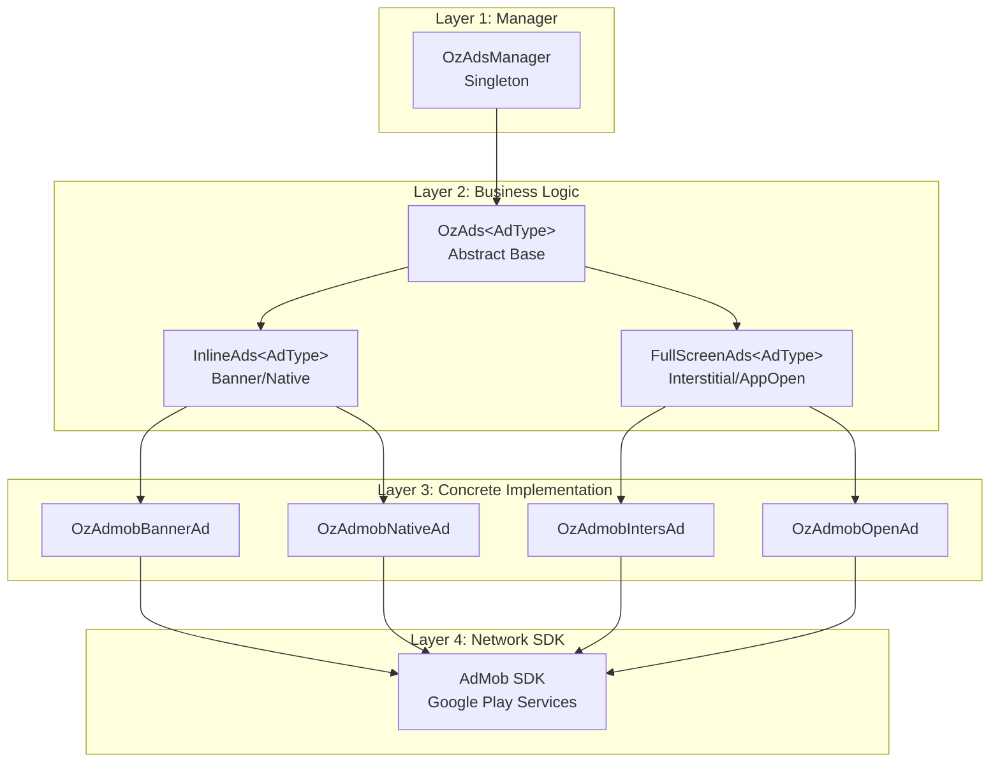
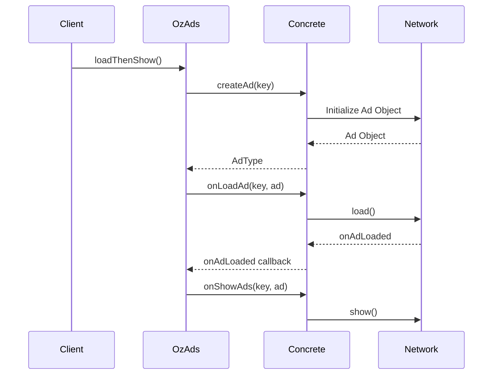
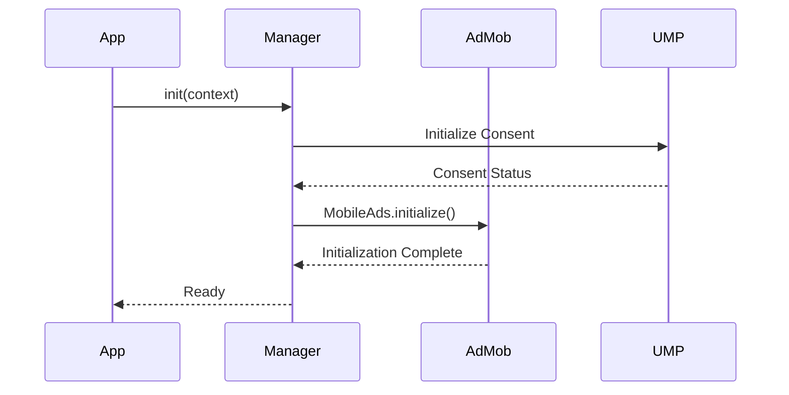

# OzAds Architecture Documentation

<div align="center">

**Internal Architecture Guide for OzAds Library**

[Overview](#overview) • [Architecture Layers](#architecture-layers) • [Core Components](#core-components) • [Design Patterns](#design-patterns) • [Usage Guide](#usage-guide)

</div>

---

## Overview

The OzAds library provides a robust, scalable, and maintainable framework for integrating various ad networks into Android applications. Built with clean architecture principles, it offers clear separation of concerns and makes it easy to add new ad formats or networks with minimal effort.

### Design Philosophy

- **Separation of Concerns** - Each layer has a single, well-defined responsibility
- **Extensibility** - Easy to add new ad formats and networks
- **Lifecycle Awareness** - Automatic handling of Android lifecycle events
- **Developer Experience** - Simple, intuitive API for common use cases
- **Type Safety** - Leverages Kotlin generics for compile-time safety

---

## Architecture Layers

The library is organized into four distinct layers:



### Layer 1: Manager Layer

**Component**: `OzAdsManager` (Singleton)

**Responsibilities**:
- Initialize ad networks (AdMob, UMP consent)
- Manage global ad state (enable/disable)
- Centralized ad object storage with key-based system
- Handle consent management and GDPR compliance

**Key Methods**:
```kotlin
class OzAdsManager {
    fun init(context: Context)
    fun setAdsEnabled(enabled: Boolean)
    fun isAdsEnabled(): Boolean
    fun getAd(key: String): Any?
    fun storeAd(key: String, ad: Any)
}
```

### Layer 2: Business Logic Layer

#### `OzAds<AdType>` - Abstract Base Class

The foundation of all ad components. Extends `ViewGroup` and defines the core workflow.

**Responsibilities**:
- Define ad lifecycle workflow
- Manage ad state (loading, loaded, failed)
- Provide callback mechanisms
- Observe global ad enabled state

**Abstract Methods**:
```kotlin
abstract class OzAds<AdType>(context: Context) : ViewGroup(context) {
    abstract fun createAd(key: String): AdType?
    abstract fun onLoadAd(key: String, ad: AdType)
    abstract fun onShowAds(key: String, ad: AdType)
    abstract fun onDestroyAd(key: String, ad: AdType)
}
```

**Workflow**:


#### `InlineAds<AdType>` - Inline Ad ViewGroup

Specialized for ads that appear inline with content (Banner, Native).

**Additional Responsibilities**:
- Auto-refresh at configurable intervals
- Visibility detection (pause when not visible)
- Automatic lifecycle management
- Shimmer loading animation
- Dynamic size calculation

**Lifecycle Hooks**:
```kotlin
abstract class InlineAds<AdType>(context: Context) : OzAds<AdType>(context) {
    override fun onAttachedToWindow() {
        // Start auto-refresh if configured
        startAutoRefresh()
    }
    
    override fun onDetachedFromWindow() {
        // Stop refresh, cleanup resources
        stopAutoRefresh()
        destroyAd()
    }
    
    override fun onVisibilityChanged(changedView: View, visibility: Int) {
        // Pause refresh when not visible
        if (visibility != VISIBLE) {
            pauseAutoRefresh()
        } else {
            resumeAutoRefresh()
        }
    }
}
```

**Auto-Refresh Mechanism**:
```kotlin
private var refreshJob: Job? = null
private var refreshTimeMs: Long = 30_000L // Default 30 seconds

fun setRefreshTime(timeMs: Long) {
    refreshTimeMs = timeMs
}

private fun startAutoRefresh() {
    refreshJob = lifecycleScope.launch {
        while (isActive) {
            delay(refreshTimeMs)
            if (isVisible && isAttachedToWindow) {
                refreshAd()
            }
        }
    }
}
```

### Layer 3: Concrete Implementation Layer

Concrete classes connect specific ad networks to the business logic layer.

**Example**: `OzAdmobBannerAd`

```kotlin
class OzAdmobBannerAd(context: Context) : InlineAds<AdmobBanner>(context) {
    
    private var collapsiblePosition: String? = null
    
    override fun createAd(key: String): AdmobBanner? {
        val adUnitId = getAdUnitId(key) ?: return null
        
        return AdmobBanner(context, adUnitId, object : OzAdListener<AdmobBanner>() {
            override fun onAdLoaded(ad: AdmobBanner) {
                this@OzAdmobBannerAd.onAdLoaded(key, ad)
            }
            
            override fun onAdFailedToLoad(error: LoadAdError) {
                this@OzAdmobBannerAd.onAdLoadFailed(key, error.message)
            }
        }).apply {
            // Apply collapsible setting if configured
            collapsiblePosition?.let { setCollapsible(it) }
        }
    }
    
    override fun onLoadAd(key: String, ad: AdmobBanner) {
        // Calculate dynamic size based on container width
        val adWidth = measuredWidth.takeIf { it > 0 } ?: resources.displayMetrics.widthPixels
        ad.setAdSize(adWidth)
        ad.load()
    }
    
    override fun onShowAds(key: String, ad: AdmobBanner) {
        // Add ad view to this ViewGroup
        removeAllViews()
        ad.show(this)
    }
    
    override fun onDestroyAd(key: String, ad: AdmobBanner) {
        ad.destroy()
    }
    
    // Public API
    fun setCollapsibleTop() {
        collapsiblePosition = "top"
    }
    
    fun setCollapsibleBottom() {
        collapsiblePosition = "bottom"
    }
}
```

### Layer 4: Network Layer

Thin wrapper around the ad network SDK (e.g., AdMob).

**Example**: `AdmobBanner`

```kotlin
class AdmobBanner(
    private val context: Context,
    private val adUnitId: String,
    private val listener: OzAdListener<AdmobBanner>
) {
    private var adView: AdView? = null
    private var adSize: AdSize? = null
    
    fun setAdSize(widthPx: Int) {
        val widthDp = (widthPx / context.resources.displayMetrics.density).toInt()
        adSize = AdSize.getCurrentOrientationAnchoredAdaptiveBannerAdSize(context, widthDp)
    }
    
    fun setCollapsible(position: String) {
        // Configure collapsible banner
    }
    
    fun load() {
        adView = AdView(context).apply {
            this.adUnitId = this@AdmobBanner.adUnitId
            this.setAdSize(adSize ?: AdSize.BANNER)
            
            adListener = object : AdListener() {
                override fun onAdLoaded() {
                    listener.onAdLoaded(this@AdmobBanner)
                }
                
                override fun onAdFailedToLoad(error: LoadAdError) {
                    listener.onAdFailedToLoad(error)
                }
            }
            
            loadAd(AdRequest.Builder().build())
        }
    }
    
    fun show(container: ViewGroup) {
        adView?.let { container.addView(it) }
    }
    
    fun destroy() {
        adView?.destroy()
        adView = null
    }
}
```

---

## Core Components

### 1. OzAdsManager (Singleton)

Central orchestrator for the entire library.

**Initialization Flow**:


**Global State Management**:
```kotlin
private val _adsEnabled = MutableStateFlow(true)
val adsEnabled: StateFlow<Boolean> = _adsEnabled.asStateFlow()

fun setAdsEnabled(enabled: Boolean) {
    _adsEnabled.value = enabled
}
```

All ad components observe this state and automatically pause/resume based on changes.

### 2. Dynamic Ad Sizing

Banner ads automatically calculate their size to maximize fill rate and revenue.

**Size Calculation**:
```kotlin
// Wait for layout to complete
override fun onLayout(changed: Boolean, l: Int, t: Int, r: Int, b: Int) {
    super.onLayout(changed, l, t, r, b)
    
    if (changed && !isAdLoaded) {
        // Container is now measured, calculate ad size
        val containerWidth = measuredWidth
        val adWidth = (containerWidth / resources.displayMetrics.density).toInt()
        
        // Get adaptive banner size for current orientation
        val adSize = AdSize.getCurrentOrientationAnchoredAdaptiveBannerAdSize(
            context, 
            adWidth
        )
        
        // Update shimmer to match ad size
        updateShimmerSize(adSize.getHeightInPixels(context))
        
        // Load ad with calculated size
        loadAd()
    }
}
```

**Benefits**:
- ✅ Works with any layout parameters (`match_parent`, `wrap_content`, fixed dp)
- ✅ Adapts to screen orientation changes
- ✅ Maximizes ad fill rate
- ✅ Seamless shimmer-to-ad transition

### 3. Collapsible Banners

Provides better UX by allowing users to collapse ads.

**Implementation**:
```kotlin
fun setCollapsibleTop() {
    collapsiblePosition = "top"
}

fun setCollapsibleBottom() {
    collapsiblePosition = "bottom"
}

// Applied during ad creation
private fun createAdRequest(): AdRequest {
    val extras = Bundle().apply {
        collapsiblePosition?.let {
            putString("collapsible", it)
        }
    }
    
    return AdRequest.Builder()
        .addNetworkExtrasBundle(AdMobAdapter::class.java, extras)
        .build()
}
```

> [!IMPORTANT]
> Collapsible position must be set **before** calling `loadAd()`. Changes after loading require a refresh.

### 4. Shimmer Loading Animation

Provides visual feedback during ad loading.

**Features**:
- Automatically matches calculated ad size
- Smooth transition to actual ad
- Customizable shimmer effect
- Hides on load failure

**Implementation**:
```kotlin
private fun showShimmer() {
    shimmerView.visibility = VISIBLE
    shimmerView.startShimmer()
}

private fun hideShimmer() {
    shimmerView.stopShimmer()
    shimmerView.visibility = GONE
}

override fun onAdLoaded(key: String, ad: AdType) {
    hideShimmer()
    showAd(ad)
}
```

---

## Design Patterns

### 1. Template Method Pattern

`OzAds` defines the algorithm skeleton, subclasses implement specific steps.

```kotlin
// Template method
fun loadThenShow() {
    val ad = createAd(key) ?: return  // Step 1: Create
    onLoadAd(key, ad)                 // Step 2: Load
    // onShowAds called automatically when loaded
}

// Concrete implementations override steps
override fun createAd(key: String): AdmobBanner { /* ... */ }
override fun onLoadAd(key: String, ad: AdmobBanner) { /* ... */ }
override fun onShowAds(key: String, ad: AdmobBanner) { /* ... */ }
```

### 2. Observer Pattern

Components observe global ad state and lifecycle events.

```kotlin
init {
    // Observe global ads enabled state
    lifecycleScope.launch {
        OzAdsManager.getInstance().adsEnabled.collect { enabled ->
            if (!enabled) {
                hideAd()
            } else if (shouldShowAd) {
                showAd()
            }
        }
    }
}
```

### 3. Strategy Pattern

Different ad loading strategies for different ad types.

```kotlin
interface AdLoadStrategy {
    fun load(ad: Any)
}

class BannerLoadStrategy : AdLoadStrategy {
    override fun load(ad: Any) {
        // Banner-specific loading
    }
}

class InterstitialLoadStrategy : AdLoadStrategy {
    override fun load(ad: Any) {
        // Interstitial-specific loading
    }
}
```

### 4. Singleton Pattern

`OzAdsManager` ensures single instance across the app.

```kotlin
class OzAdsManager private constructor() {
    companion object {
        @Volatile
        private var instance: OzAdsManager? = null
        
        fun getInstance(): OzAdsManager {
            return instance ?: synchronized(this) {
                instance ?: OzAdsManager().also { instance = it }
            }
        }
    }
}
```

---

## Usage Guide

### Adding a New Ad Format

To add a new ad format (e.g., Rewarded Ad):

1. **Create Network Wrapper** (`AdmobRewarded.kt`):
```kotlin
class AdmobRewarded(
    private val context: Context,
    private val adUnitId: String,
    private val listener: OzAdListener<AdmobRewarded>
) {
    private var rewardedAd: RewardedAd? = null
    
    fun load() { /* Load rewarded ad */ }
    fun show(activity: Activity) { /* Show rewarded ad */ }
    fun destroy() { /* Cleanup */ }
}
```

2. **Create Concrete Implementation** (`OzAdmobRewardedAd.kt`):
```kotlin
class OzAdmobRewardedAd(context: Context) : OzAds<AdmobRewarded>(context) {
    
    override fun createAd(key: String): AdmobRewarded? {
        val adUnitId = getAdUnitId(key) ?: return null
        return AdmobRewarded(context, adUnitId, createListener())
    }
    
    override fun onLoadAd(key: String, ad: AdmobRewarded) {
        ad.load()
    }
    
    override fun onShowAds(key: String, ad: AdmobRewarded) {
        ad.show(getActivity())
    }
    
    override fun onDestroyAd(key: String, ad: AdmobRewarded) {
        ad.destroy()
    }
}
```

3. **Use in Application**:
```kotlin
val rewardedAd = OzAdmobRewardedAd(context)
rewardedAd.setAdUnitId("rewarded_key", "ca-app-pub-xxx")
rewardedAd.loadThenShow()
```

### Adding a New Ad Network

To add a new network (e.g., Meta Audience Network):

1. **Create Network Wrapper** (`MetaBanner.kt`, `MetaInterstitial.kt`, etc.)
2. **Create Concrete Implementations** (`OzMetaBannerAd.kt`, etc.)
3. **Update OzAdsManager** to initialize the new network
4. **Provide network-specific configuration**

---

## Best Practices

### 1. Lifecycle Management

✅ **Do**: Let `InlineAds` handle lifecycle automatically
```kotlin
// No manual lifecycle calls needed!
val banner = findViewById<OzAdmobBannerAd>(R.id.banner)
banner.loadThenShow()
```

❌ **Don't**: Manually manage lifecycle in Activity/Fragment
```kotlin
// Not necessary!
override fun onPause() {
    banner.pause() // InlineAds does this automatically
}
```

### 2. Error Handling

✅ **Do**: Provide fallback behavior
```kotlin
intersAd.listener = object : OzAdListener<AdmobInterstitial>() {
    override fun onAdFailedToLoad(error: LoadAdError) {
        // Continue without ad
        navigateToNextScreen()
    }
}
```

❌ **Don't**: Block user flow waiting for ads
```kotlin
// Bad: User stuck if ad fails
intersAd.loadThenShow(activity)
// No fallback!
```

### 3. Memory Management

✅ **Do**: Use appropriate ad types for use case
```kotlin
// Banner for persistent display
val banner = OzAdmobBannerAd(context)

// Interstitial for transitions
val inters = OzAdmobIntersAd(context)
```

❌ **Don't**: Keep references to destroyed ads
```kotlin
// Bad: Memory leak
class MyActivity : Activity() {
    private val banner = OzAdmobBannerAd(this) // Leaks activity!
}
```

### 4. Testing

✅ **Do**: Use test ad unit IDs during development
```kotlin
if (BuildConfig.DEBUG) {
    banner.setAdUnitId("key", "ca-app-pub-3940256099942544/6300978111")
} else {
    banner.setAdUnitId("key", "ca-app-pub-YOUR_REAL_ID")
}
```

---

## Performance Considerations

### 1. Preloading

Preload ads before they're needed:
```kotlin
// In onCreate
intersAd.loadAd()

// Later, when needed
button.setOnClickListener {
    intersAd.show(activity)
}
```

### 2. Auto-Refresh Intervals

Choose appropriate refresh intervals:
- **Banner**: 30-60 seconds (default: 30s)
- **Native**: 60-120 seconds

```kotlin
banner.setRefreshTime(60_000L) // 60 seconds
```

### 3. Visibility Detection

Ads automatically pause when not visible, saving resources:
```kotlin
// Automatic in InlineAds
override fun onVisibilityChanged(changedView: View, visibility: Int) {
    if (visibility != VISIBLE) {
        pauseAutoRefresh() // Saves battery and bandwidth
    }
}
```

---

## Troubleshooting

### Common Issues

#### 1. Ads Not Showing

**Possible Causes**:
- AdMob App ID not configured in `AndroidManifest.xml`
- Using production ad unit IDs before app is approved
- Global ads disabled via `OzAdsManager.setAdsEnabled(false)`

**Solution**:
```kotlin
// Check global state
if (!OzAdsManager.getInstance().isAdsEnabled()) {
    Log.w("Ads", "Ads are globally disabled")
}

// Use test IDs during development
banner.setAdUnitId("key", "ca-app-pub-3940256099942544/6300978111")
```

#### 2. App Crashes on Launch

**Cause**: Missing AdMob App ID in manifest

**Solution**:
```xml
<meta-data
    android:name="com.google.android.gms.ads.APPLICATION_ID"
    android:value="ca-app-pub-XXXXXXXXXXXXXXXX~YYYYYYYYYY"/>
```

#### 3. Ads Not Refreshing

**Cause**: View not attached or not visible

**Solution**:
```kotlin
// Ensure view is attached and visible
banner.visibility = View.VISIBLE
// Auto-refresh starts automatically when attached
```

---

## Future Enhancements

Potential improvements for future versions:

- [ ] Support for additional ad networks (Meta, Unity, AppLovin)
- [ ] Rewarded ad support
- [ ] Rewarded interstitial ad support
- [ ] Advanced mediation support
- [ ] A/B testing framework
- [ ] Analytics integration
- [ ] Ad quality monitoring
- [ ] Custom ad rendering engine

---

<div align="center">

**Internal Documentation for OzAds Library**

For public documentation, see [README.md](readme.md)

</div>
